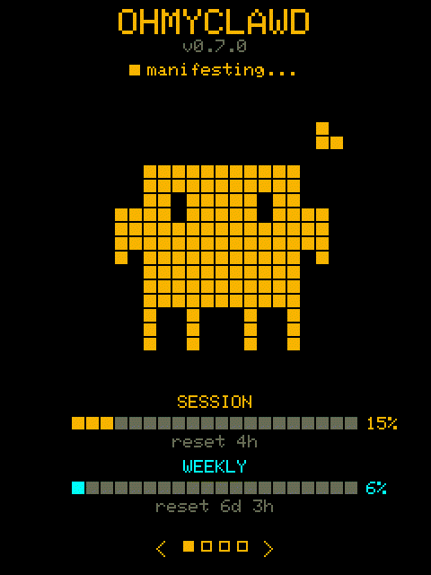
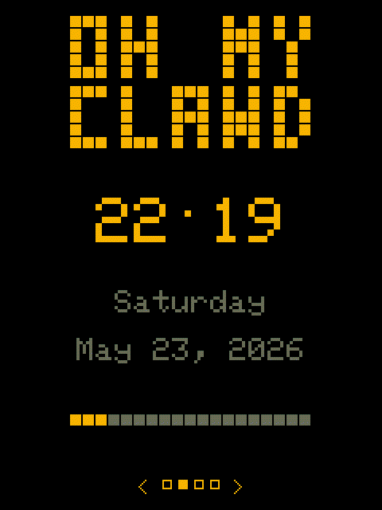
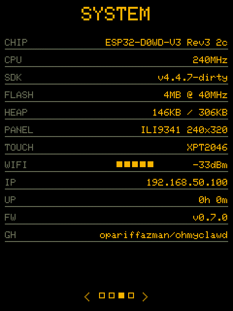

```
 ██████  ██   ██     ███    ███ ██    ██
██    ██ ██   ██     ████  ████  ██  ██
██    ██ ███████     ██ ████ ██   ████
██    ██ ██   ██     ██  ██  ██    ██
 ██████  ██   ██     ██      ██    ██

 ██████ ██       █████  ██     ██ ██████
██      ██      ██   ██ ██     ██ ██   ██
██      ██      ███████ ██  █  ██ ██   ██
██      ██      ██   ██ ██ ███ ██ ██   ██
 ██████ ███████ ██   ██  ███ ███  ██████
```

Claude Code usage monitor on the ESP32-2432S028R (CYD 2.8") with pixel art animations.

 |  | 
:---:|:---:|:---:

Displays real-time Claude Code session and weekly usage with animated pixel sprites and a digital clock.

## Features

- **Real-time usage bars** — session and weekly utilization at a glance
- **13 animated pixel sprites** — changes based on Claude Code activity state
- **Tmux session detection** — knows when Claude is waiting for your input
- **OTA firmware updates** — checks GitHub releases on boot, tap to update
- **Configurable via captive portal** — no code changes needed for WiFi/daemon setup
- **Pixel clock mode** — retro digital clock with second-progress bar
- **On-device settings** — granular brightness, quiet hours, auto-cycle, sprite mode, orientation, and factory reset via hold-drag sliders
- **Page navigation** — bottom-screen indicator dots + `<` `>` tap buttons
- **Offline indicator** — pixel `X` glyph and colour-drain when the daemon or Wi-Fi is unreachable

## Hardware

- **Board:** ESP32-2432S028R (CYD 2.8")
- **Display:** 2.8" ILI9341 320×240 TFT
- **Touch:** XPT2046 resistive touchscreen
- **Connectivity:** WiFi (2.4 GHz)

## Quick Start

### 1. Install the daemon

The daemon runs on your machine (where Claude Code runs), polls the Anthropic API for rate-limit headers, and serves usage data over HTTP.

**Linux (one-liner):**

```bash
curl -fsSL https://raw.githubusercontent.com/opariffazman/ohmyclawd/master/install.sh | sudo bash
```

This downloads the latest binary, installs to `/usr/local/bin`, and sets up a systemd service.

**With authentication (recommended for remote access):**

```bash
curl -fsSL https://raw.githubusercontent.com/opariffazman/ohmyclawd/master/install.sh \
  | OHMYCLAWD_TOKEN=yourpassphrase sudo -E bash
```

**Other platforms** — download from [Releases](https://github.com/opariffazman/ohmyclawd/releases):

| Platform | Binary |
|----------|--------|
| Linux x64 | `ohmyclawd-daemon-linux-amd64` |
| macOS x64 | `ohmyclawd-daemon-darwin-amd64` |
| macOS ARM | `ohmyclawd-daemon-darwin-arm64` |
| Windows x64 | `ohmyclawd-daemon-windows-amd64.exe` |

```bash
# Linux/macOS
chmod +x ohmyclawd-daemon-*
./ohmyclawd-daemon-linux-amd64

# With token
OHMYCLAWD_TOKEN=yourpassphrase ./ohmyclawd-daemon-linux-amd64

# Windows
set OHMYCLAWD_TOKEN=yourpassphrase
ohmyclawd-daemon-windows-amd64.exe
```

### 2. Flash the firmware

**Browser (easiest):** Visit the [Web Flasher](https://opariffazman.github.io/ohmyclawd/) — connect your CYD via USB and click install. No tools needed.

**PlatformIO:**

```bash
git clone https://github.com/opariffazman/ohmyclawd.git
cd ohmyclawd
pio run -e cyd -t upload
```

Or download `ohmyclawd-firmware.bin` from [Releases](https://github.com/opariffazman/ohmyclawd/releases) and flash with esptool:

```bash
esptool.py write_flash 0x10000 ohmyclawd-firmware.bin
```

### 3. Configure the CYD

On first boot, the CYD creates a WiFi access point:

1. Connect to **`OhMyClawd`** on your phone/laptop
2. A captive portal opens (or browse to `192.168.4.1`)
3. Enter your **WiFi SSID** and **password**
4. Set the **Daemon URL** (default: `http://ohmyclawd.local:8787`)
5. Set the **Daemon Token** (optional — must match `OHMYCLAWD_TOKEN` on daemon)
6. Set your **Timezone** (default: `UTC-8`, see [POSIX TZ format](https://www.gnu.org/software/libc/manual/html_node/TZ-Variable.html))
7. Save — the CYD reboots and connects

Settings persist across reboots. Hold touch for 5 seconds to reset and reconfigure (or use the RESET row in SETTINGS for a 3-second hold).

### 4. Done!

The CYD shows your Claude Code usage. Tap to cycle sprites, swipe or use `<` `>` buttons to switch modes.

## Sprite States

The animated sprite changes based on your Claude Code status (requires Claude Code sessions running in tmux):

| State | Sprite | Trigger |
|---|---|---|
| Needs input | expression-surprise, expression-wink | Claude session idle >30s in tmux |
| Rate limited | expression-sleep, idle-breathe | Session usage ≥ 80% |
| Heavy usage | work-think, idle-look-around | Session usage 50–79% |
| Moderate usage | work-coding, dance-djmix | Session usage 25–49% |
| Light usage | dance-bounce, dance-sway, bounce-dj, sway-dj, idle-blink | Session usage < 25% |

## On-device settings

Swipe through modes until you reach **SETTINGS**. Auto-cycle does NOT visit settings — it must be reached manually via swipe or `<` `>` nav buttons.

All `*` rows use **hold-drag sliders**: hold for 0.5s until the orange bar appears, then drag left/right to adjust. Tap **SAVE** to persist changes. Swiping away without saving discards changes.

| Row | Interaction | Description |
|---|---|---|
| BRIGHTNESS * | hold-drag | 10–100% granular PWM, live preview while adjusting |
| QUIET START * | hold-drag | Start hour (0–23) for quiet window |
| QUIET END * | hold-drag | End hour (0–23), supports cross-midnight (e.g. 22→07) |
| QUIET MODE | tap-cycle | `OFF` / `DIM` / `SLEEP` — DIM uses minimum brightness, SLEEP turns backlight off |
| AUTO-CYCLE * | hold-drag | 5–250s rotation interval, or OFF (drag to 0) |
| SPRITE MODE | tap-cycle | `DYNAMIC` (changes with usage state) / `FREE` (manual cycle) |
| ORIENTATION | tap-cycle | `NORMAL` (USB at bottom) / `FLIPPED` (USB at top) |
| RESET | hold 3s | Orange bar fills L→R, then clears Wi-Fi + settings and reboots |
| SAVE | tap | Persists all pending changes to NVS |

While quiet hours is in `SLEEP` mode, the screen is dark. Tap to wake the backlight for 10 seconds — subsequent taps during the wake window work normally (swipe, nav, etc.).

When the daemon or Wi-Fi is unreachable, the usage bars and sprite drain to dark grey, and a pulsing red `X` appears top-right. Full colour returns automatically when the daemon is reachable again.

**Firmware:** updates itself via OTA — on boot it checks GitHub for a newer release and prompts to update.

**Daemon:** re-run the install script:

```bash
curl -fsSL https://raw.githubusercontent.com/opariffazman/ohmyclawd/master/install.sh | sudo bash
```

## Daemon

The daemon runs on your machine (where Claude Code runs), polls the Anthropic API for rate-limit headers, and serves usage data over HTTP.

See [daemon/README.md](daemon/README.md) for full setup instructions and platform downloads.

### Configuration

| Env var | Default | Description |
|---------|---------|-------------|
| `OHMYCLAWD_LISTEN` | `127.0.0.1:8787` | Bind address. Use `:8787` for LAN access |
| `OHMYCLAWD_TOKEN` | *(empty)* | Bearer token. If set, `/usage` and `/metrics` require `Authorization: Bearer <token>` |
| `OHMYCLAWD_PROBE_INTERVAL` | `60s` | How often to poll Anthropic rate-limit headers |
| `OHMYCLAWD_CREDS_PATH` | `~/.claude/.credentials.json` | Path to Claude Code OAuth credentials |

### Access modes

| Scenario | LISTEN | TOKEN |
|----------|--------|-------|
| Local only (default) | `127.0.0.1:8787` | unset |
| LAN (no auth) | `:8787` | unset |
| LAN (with auth) | `:8787` | `<passphrase>` |
| Cloudflare Tunnel | `127.0.0.1:8787` | `<passphrase>` |

`/healthz` is always open (no auth required) for health checks.

## Native Screen Recording

Pixel-perfect GIF capture directly from the ESP32 framebuffer — no camera needed. See [docs/assets/NATIVE_RECORDING.md](docs/assets/NATIVE_RECORDING.md) for usage instructions.

## Project Structure

```
├── platformio.ini        # Build config, pin definitions, library deps
├── claudepix/            # Source HTML animations from claudepix
├── daemon/               # ohmyclawd daemon (Go) - polls Anthropic API
│   ├── main.go           # HTTP server on :8787
│   ├── probe.go          # Anthropic rate-limit header polling
│   ├── loop.go           # Probe scheduling with backoff
│   ├── handlers.go       # /usage, /healthz, /metrics endpoints
│   ├── usage.go          # Usage struct (JSON wire format)
│   ├── creds.go          # Claude OAuth credential loader
│   ├── fake.go           # Fake mode for testing
│   ├── install.sh        # Install script
│   └── systemd/          # systemd service file
├── .github/workflows/    # CI: test + release binary
└── src/
    ├── main.cpp          # Firmware source (setup, loop, input, OTA)
    ├── globals.h         # Shared state and forward declarations
    ├── mode_sprite.h     # Sprite animation + usage bars
    ├── mode_clock.h      # Digital clock with second-progress bar
    ├── mode_system.h     # System info screen
    ├── settings_ui.h     # On-device settings (sliders, save, reset)
    ├── capture.h         # Native screen capture (sprite + BMP + WiFi POST)
    ├── display_pm.h      # Backlight PWM, quiet hours, sleep/wake
    ├── offline_ind.h     # Offline state machine + colour drain
    └── sprite_frames.h   # RLE-compressed animation frame data (13 presets)
```

## How It Works

The daemon reads your Claude Code OAuth credentials from `~/.claude/.credentials.json` (created automatically when you authenticate Claude Code). It uses the access token to make lightweight requests to the Anthropic API and reads the rate-limit response headers to determine your current session and weekly usage percentages. No messages are sent or read — it only inspects HTTP headers.

## Credits

- Pixel animations from [claudepix](https://claudepix.vercel.app/)

## Disclaimer

This project is unofficial and not affiliated with Anthropic. It relies on undocumented rate-limit headers from the Anthropic API which may change without notice. The daemon requires read-only access to your local Claude Code credentials file — it does not transmit, store, or expose your tokens over the network. Use at your own risk.

## License

[MIT](LICENSE)
