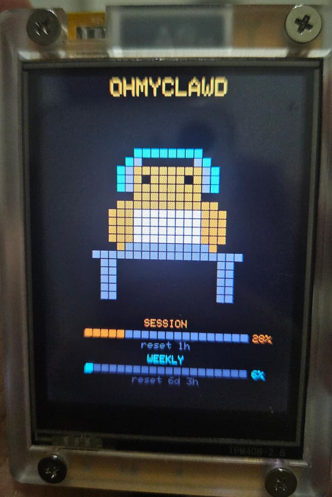
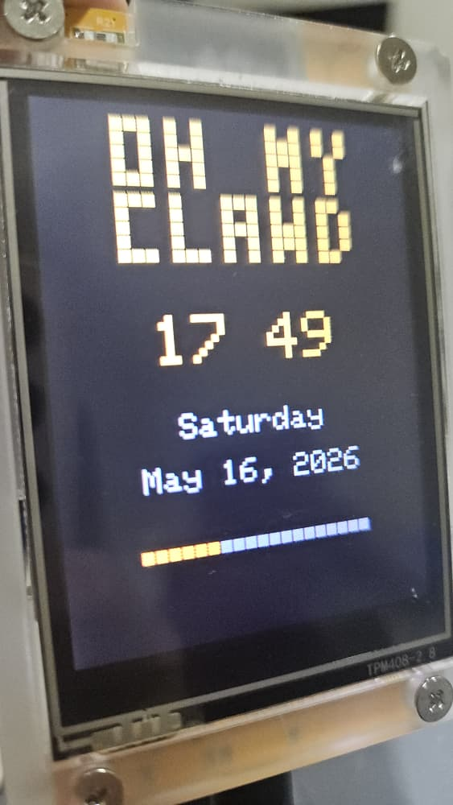

```
 ██████  ██   ██     ███    ███ ██    ██
██    ██ ██   ██     ████  ████  ██  ██
██    ██ ███████     ██ ████ ██   ████
██    ██ ██   ██     ██  ██  ██    ██
 ██████  ██   ██     ██      ██    ██

 ██████ ██       █████  ██     ██ ██████
██      ██      ██   ██ ██     ██ ██   ██
██      ██      ███████ ██  █  ██ ██   ██
██      ██      ██   ██ ██ ███ ██ ██   ██
 ██████ ███████ ██   ██  ███ ███  ██████
```

Claude Code usage monitor on the ESP32-2432S028R (CYD 2.8") with pixel art animations.

 |  | <video src="ohmyclawd3.mp4" autoplay loop muted playsinline width="250"></video>
:---:|:---:|:---:

Displays real-time Claude Code session and weekly usage with animated pixel sprites and a digital clock.

## Modes

1. **Usage + Sprite** (default) — animated Claude pixel creature with session/weekly usage grid bars and reset timers
2. **Clock** — pixel-art "OH MY CLAWD" banner, digital clock, date, and orange grid second-progress bar

Tap the touchscreen to switch modes. Hold for 5 seconds to reset WiFi and daemon URL settings.

## Hardware

- **Board:** ESP32-2432S028R (CYD 2.8")
- **Display:** 2.8" ILI9341 320×240 TFT
- **Touch:** XPT2046 resistive touchscreen
- **Connectivity:** WiFi (2.4 GHz)

## Build & Flash

Requires [PlatformIO](https://platformio.org/).

```bash
pio run -e cyd -t upload
pio device monitor
```

## Setup

On first boot (or after a 5-second touch reset), the CYD creates an access point:

1. Connect to WiFi network **`OhMyClawd`**
2. A captive portal opens (or browse to `192.168.4.1`)
3. Enter your WiFi SSID, password, and daemon URL
4. Default daemon URL: `http://ohmyclawd.local:8787`
5. The CYD reboots and connects to your network

Settings persist across reboots.

## Display Color Fix

Some CYD units have inverted panels. Toggle in `setup()`:

```cpp
tft.invertDisplay(true);   // try false if colors are inverted
```

## Project Structure

```
├── platformio.ini        # Build config, pin definitions, library deps
├── claudepix/            # Source HTML animations from claudepix
├── daemon/               # ohmyclawd daemon (Go) - polls Anthropic API
│   ├── main.go           # HTTP server on :8787
│   ├── probe.go          # Anthropic rate-limit header polling
│   ├── loop.go           # Probe scheduling with backoff
│   ├── handlers.go       # /usage, /healthz, /metrics endpoints
│   ├── usage.go          # Usage struct (JSON wire format)
│   ├── creds.go          # Claude OAuth credential loader
│   ├── fake.go           # Fake mode for testing
│   ├── install.sh        # Install script
│   └── systemd/          # systemd service file
├── .github/workflows/    # CI: test + release binary
└── src/
    ├── main.cpp          # Firmware source
    └── sprite_frames.h   # Generated animation frame data (13 presets)
```

## Daemon

The daemon runs on your server, polls the Anthropic API for rate-limit headers, and serves usage data over HTTP.

```bash
cd daemon
go build -o ohmyclawd-daemon .
./ohmyclawd-daemon
```

Or use the install script for systemd:

```bash
cd daemon && ./install.sh
```

Environment variables:
- `OHMYCLAWD_LISTEN` — listen address (default `:8787`)
- `OHMYCLAWD_PROBE_INTERVAL` — probe interval (default `60s`)
- `OHMYCLAWD_CREDS_PATH` — path to Claude credentials (default `~/.claude/.credentials.json`)

Test with fake data: `./ohmyclawd-daemon --fake`

## Credits

- Pixel animations from [claudepix](https://claudepix.vercel.app/) by [Kevin Lynagh](https://github.com/lynaghk)
